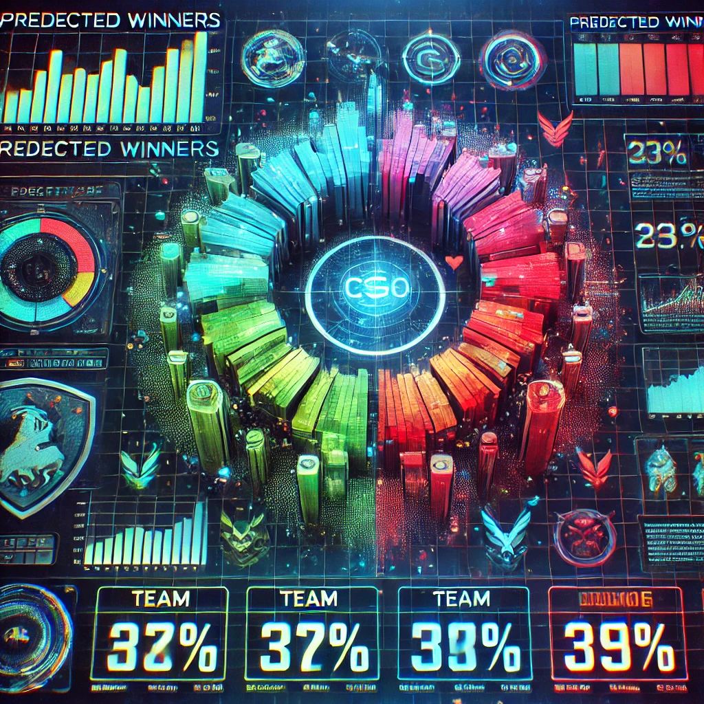
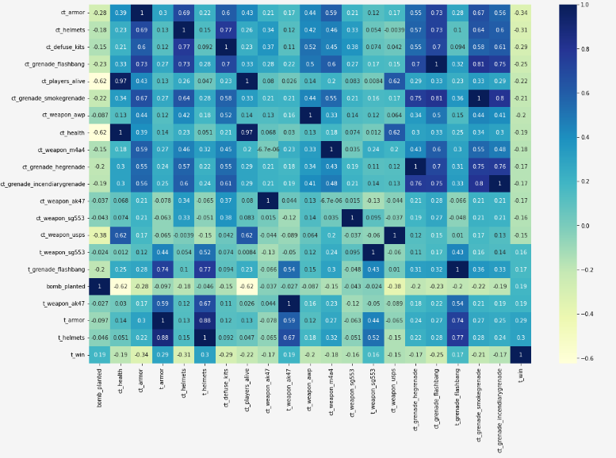

---

# CSGO Game Winner Prediction with Heatmap Visualization

This project leverages machine learning to predict winners of Counter-Strike: Global Offensive (CSGO) matches. It utilizes multiple machine learning models, including KNeighborsClassifier, RandomizedSearchCV, RandomForestClassifier, and Sequential (deep learning). All models are implemented within a single Jupyter Notebook for ease of comparison. The results are visualized as a heatmap for better interpretability.

---
<div align="center">
  
</div>

## Features

- Multiple machine learning models:
  - **KNeighborsClassifier** for instance-based learning.
  - **RandomizedSearchCV** for hyperparameter tuning.
  - **RandomForestClassifier** for ensemble learning.
  - **Sequential Model** for deep learning.
- Heatmap visualization of prediction outcomes.
- Single Jupyter Notebook implementation for seamless execution.

---

## Prerequisites

Ensure you have the following installed before running the project:

- **Python 3.x**
- **Jupyter Notebook**
- Required libraries:
  ```bash
  pip install numpy pandas matplotlib seaborn scikit-learn tensorflow
  ```

---

## Project Structure

- **`csgo_prediction.ipynb`**: Jupyter Notebook containing the complete code for:
  - Data loading and preprocessing.
  - Model training and evaluation.
  - Visualization of results.
- **`heatmap.png`**: Sample heatmap visualization of prediction results.
- **`README.md`**: Documentation file (this file).

---

## Installation and Usage

1. Clone the repository:
   ```bash
   git clone https://github.com/yourusername/csgo-winner-prediction.git
   ```

2. Navigate to the project directory:
   ```bash
   cd csgo-winner-prediction
   ```

3. Open the Jupyter Notebook:
   ```bash
   jupyter notebook csgo_prediction.ipynb
   ```

4. Follow the steps in the notebook to:
   - Load and preprocess the dataset.
   - Train multiple models.
   - Visualize predictions using a heatmap.

---

## Workflow

1. **Data Preparation**:
   - Load the dataset into a Pandas DataFrame.
   - Perform cleaning and preprocessing, including handling missing values and encoding categorical features.

2. **Model Training**:
   - Train and evaluate the following models:
     - KNeighborsClassifier.
     - RandomizedSearchCV for hyperparameter optimization.
     - RandomForestClassifier.
     - Sequential model for deep learning.
   - Compare model performance metrics.

3. **Visualization**:
   - Use the best-performing model to generate predictions.
   - Create a heatmap using `seaborn` to visualize predicted outcomes.

---

## Example Output

### Heatmap of Predicted Winners



This heatmap illustrates the predicted probabilities of winning for different teams in the dataset.

---

## Future Improvements

- Include additional features such as player statistics and map-specific data for better accuracy.
- Implement a more robust hyperparameter tuning process for all models.
- Add deployment capabilities for real-time predictions.

---

## Acknowledgments

- **scikit-learn**: For machine learning algorithms.
- **TensorFlow/Keras**: For building the deep learning model.
- **Matplotlib & Seaborn**: For data visualization.
- **CSGO community**: For inspiration and game-related insights.

---

Feel free to contribute to the project or raise any issues you encounter. Pull requests are welcome!

--- 
